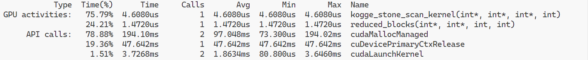

# CUDA Profiling Optimization

## Overview
**Device:** Quadro T1000 (0)

### Profiling Results

From the profiling summary: ``prefixSum_basic.cu``

- **kogge_stone_scan_kernel**: This kernel took 4.608 microseconds, accounting for 75.79% of the total GPU time.
- **reduced_blocks**: This kernel took 1.472 microseconds, accounting for 24.21% of the GPU time.
- **cudaMallocManaged**: This API call took 194.10 milliseconds (with 97.048ms per call on average) and contributed significantly to the overall execution time.

# Unified Memory Profiling Result

| Count | Avg Size | Min Size | Max Size | Total Size | Total Time | Name           |
|-------|----------|----------|----------|------------|------------|----------------|
| 2     | 4.0000KB | 4.0000KB | 4.0000KB | 8.000000KB | 22.30000us | Host To Device |
| 3     | 4.0000KB | 4.0000KB | 4.0000KB | 12.00000KB | 6.000000us | Device To Host |

### Improvements and Optimizations

#### Replaced `cudaMallocManaged` with `cudaHostAlloc`

From the profiling summary: ``prefixSum.cu``  

To further improve memory usage and data transfer efficiency, we replaced `cudaMallocManaged` with `cudaHostAlloc` for allocating pinned (page-locked) memory on the host. This allows for faster data transfers between the host and device, as shown in the following metrics:

rove memory usage and data transfer efficiency, we replaced `cudaMallocManaged` with `cudaHostAlloc` for allocating pinned (page-locked) memory on the host. This allows for faster data transfers between the host and device, as shown in the following metrics:

| Type            | Time(%) | Time      | Calls | Avg      | Name                                                       |
|-----------------|---------|-----------|-------|----------|------------------------------------------------------------|
| **GPU activities:**  |         |           |       |          |                                                            |
|                 | 35.88%  | 3.9040us  | 1     | 3.9040us | [CUDA memcpy HtoD]                                         |
|                 | 30.88%  | 3.3600us  | 1     | 3.3600us | `kogge_stone_scan_kernel(int*, int*, int*, int)`           |
|                 | 19.42%  | 2.1130us  | 1     | 2.1130us | [CUDA memcpy DtoH]                                         |
|                 | 13.82%  | 1.5040us  | 1     | 1.5040us | `reduced_blocks(int*, int*, int, int)`                     |

These optimizations resulted in the following improvements:

- **Reduced Memory Transfer Times**: By using pinned memory via `cudaHostAlloc`, we improved the efficiency of memory transfers between the host and the device.
- **Lowered Overall GPU Activity Time**: The kernel execution times are now more balanced with the memory transfer times, optimizing the overall performance.